# Actividad 1

## Parte1

### Creación de Usuarios
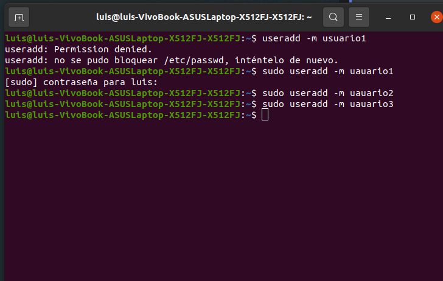
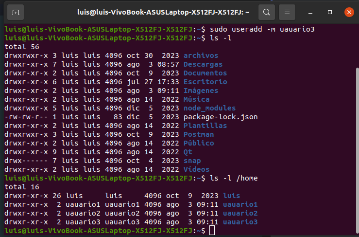

### Creación de Contraseñas
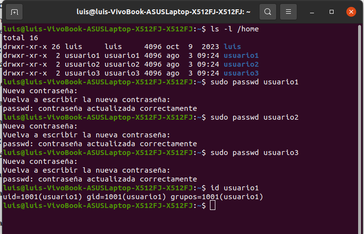
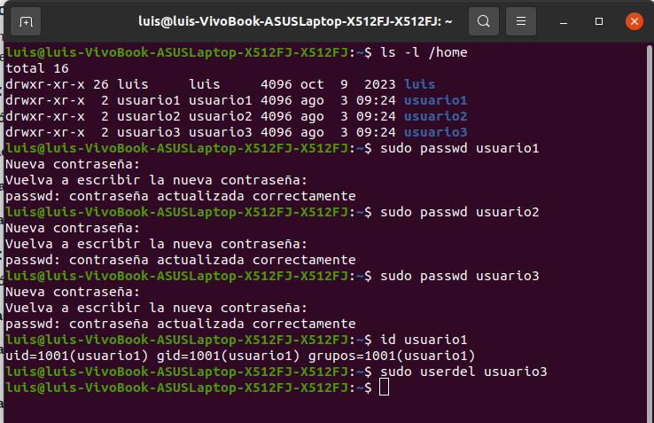

## Parte2

### Creación de Grupos
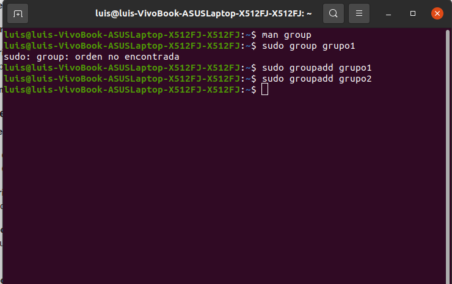

### Agregar Usuarios a Grupos
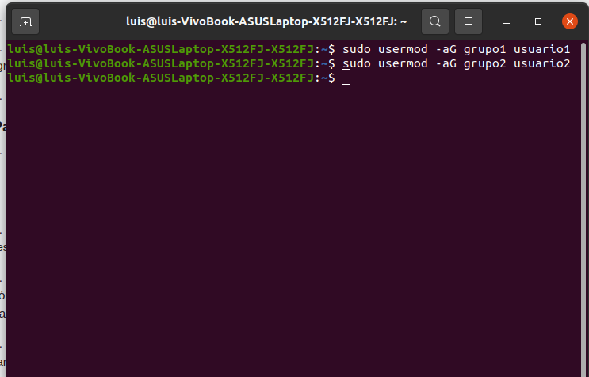
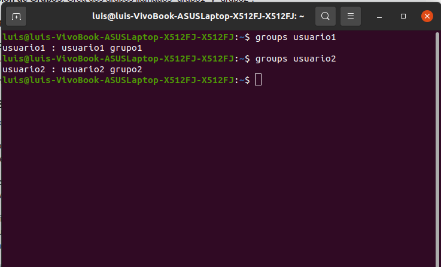

### Verificar Membresía

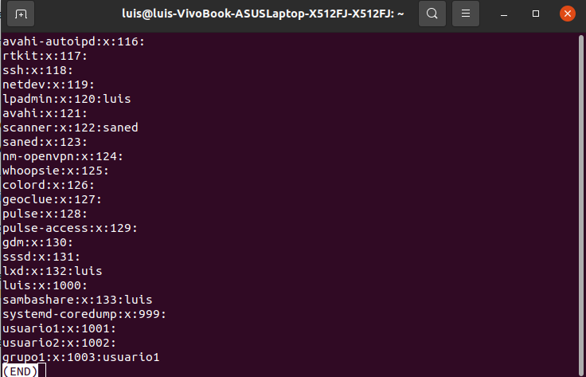

### Eliminar Grupo 2
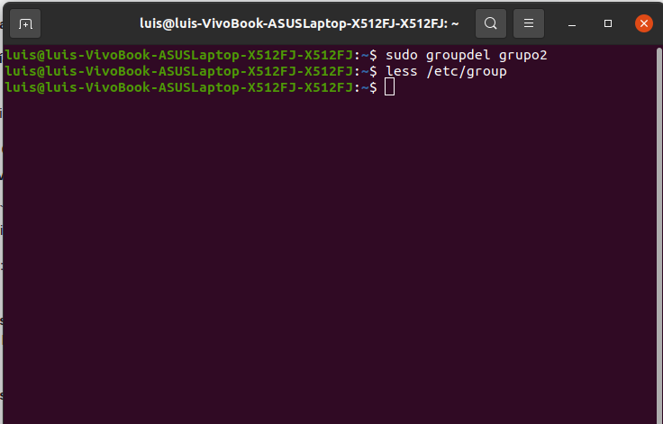

## Parte3

### Creación de Archivos y Directorios
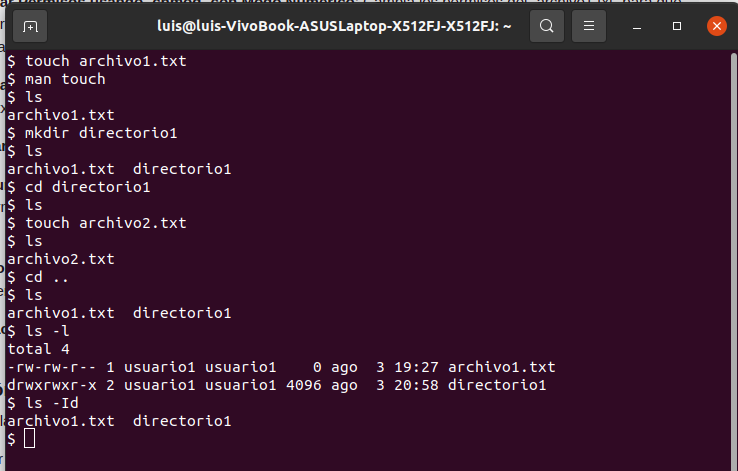

### Verificar Permisos
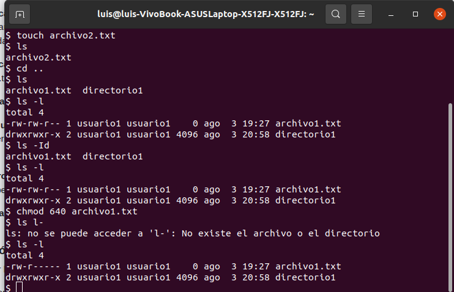

### Modificar Permisos usando chmod con Modo Numérico
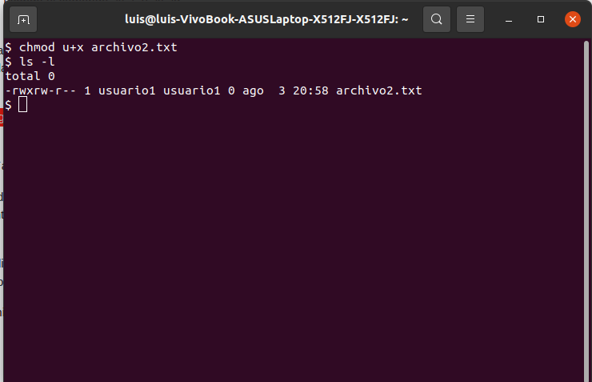
### Modificar Permisos usando chmod con Modo Simbólico
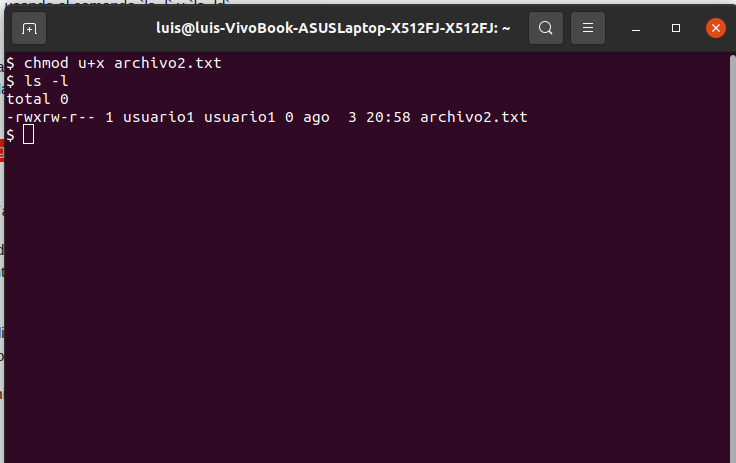

### Cambiar el Grupo Propietario
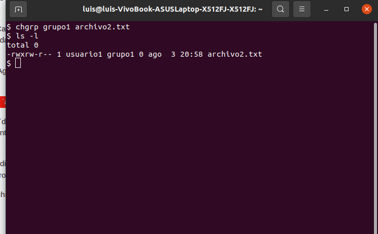
### Configurar Permisos de Directorio
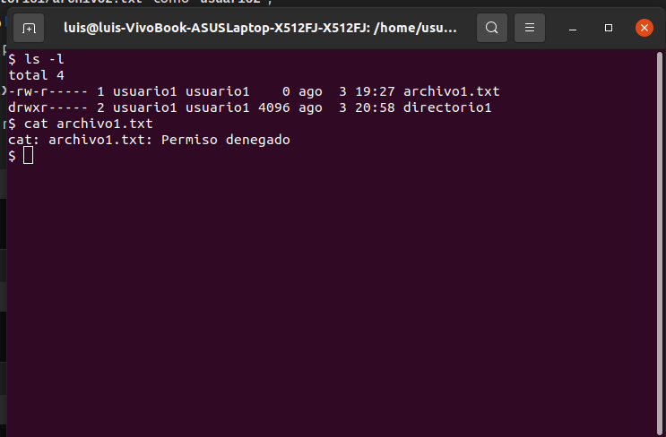
### Comprobación de Acceso
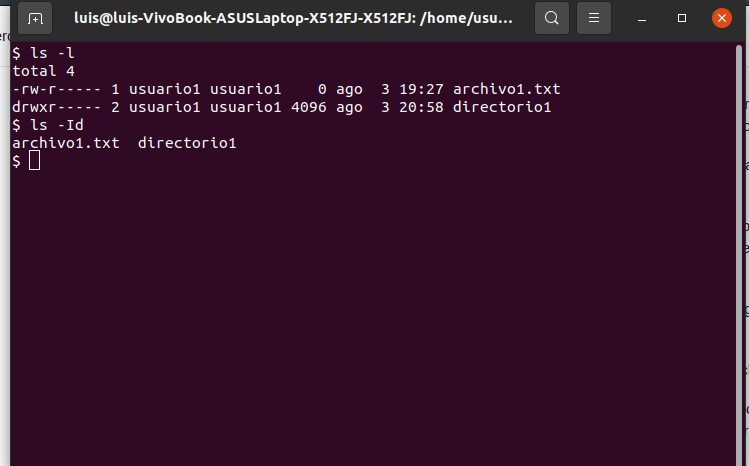

### Verificación Final
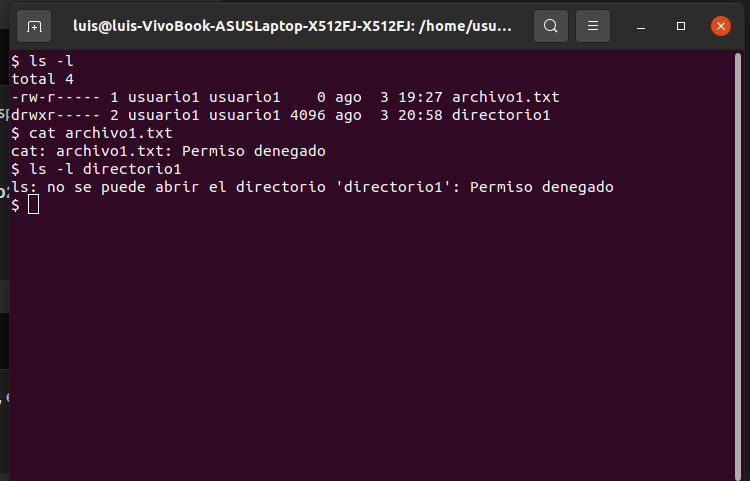