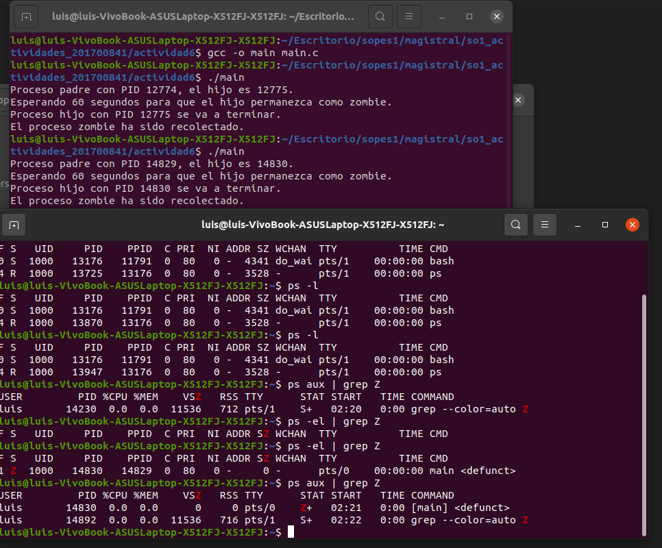

# Actividad 6

## Problema 1

El programa tiene 8 procesos en total, cada vez que se llama a fork(); se crea un nuevo proceso y cada proceso ejecuta nuevamente el fork(); 

Inicio: Al principio, solo hay 1 proceso, el programa original.
Primera llamada a fork():
El proceso original llama a fork() y se crea 1 nuevo proceso. Ahora hay 2 procesos en total.
Segunda llamada a fork():
Cada uno de esos 2 procesos llama a fork(), lo que significa que cada uno crea otro proceso. Ahora hay 4 procesos en total.
Tercera llamada a fork():
Los 4 procesos actuales vuelven a llamar a fork(), y cada uno crea un nuevo proceso. Ahora hay 8 procesos en total.

## Problema 2

## Problema 3

### Primera pregunta:

Cada fork(); duplica el numero de procesos.
    • Primer fork: Crea 1 nuevo proceso, ahora hay 2 procesos en total.
    • Segundo fork: Dentro del proceso hijo, se ejecuta el segundo fork(), lo que crea un proceso adicional. Ahora hay 3 procesos en total.
    • Tercer fork: Este fork() se ejecuta tanto en el proceso padre como en los otros dos procesos. Cada proceso crea un nuevo proceso, lo que significa que se añaden 3 procesos más. Ahora hay 6 procesos en total.

### Segunda pregunta:

Se crea solo uno, el proceso hijo (dentro del bloque if (pid == 0)), se llama a pthread_create() una vez para crear un hilo