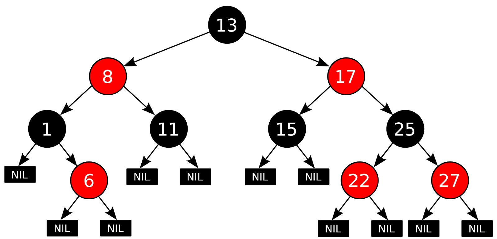

# Actividad 7
## Describir las características principales y el funcionamiento del Completely Fair Scheduler (CFS) de Linux

Se le conoce como: planificador de procesos predeterminado en Linux, el cual garantiza una distribución equitativa del tiempo de CPU entre los procesos.

### - Características principales de CFS
1. Distribución justa del tiempo de CPU: CFS se enfoca en distribuir equitativamente el tiempo de CPU entre los procesos, de acuerdo con su prioridad e importancia. A diferencia de otros sistemas que utilizan ticks de reloj para la planificación, CFS busca reducir el tiempo de espera acumulado de cada proceso.

2. Árbol Rojo-Negro: El CFS utiliza una estructura de datos llamada árbol rojo-negro, que es auto-balanceada y permite que las operaciones, como inserciones y eliminaciones, sean eficientes. Esto garantiza que seleccionar el próximo proceso a ejecutar sea rápido y preciso, incluso cuando hay muchos procesos activos.

3. Tiempo de ejecución virtual: CFS mide el uso de CPU de cada proceso mediante una métrica llamada "tiempo de ejecución virtual". Este tiempo aumenta conforme el proceso usa la CPU, y el CFS prioriza al proceso que ha consumido menos tiempo hasta ese momento. Esto es diferente a otros planificadores que simplemente rotan los procesos en secuencia.

4. Latencia mínima: CFS también ajusta el tiempo que cada proceso pasa en la CPU cuando hay muchos procesos en cola, asegurando que ninguno quede sin atención por mucho tiempo. Esto ayuda a mantener la latencia percibida baja, lo que es crucial para sistemas interactivos.

5. Gestión de prioridades: Aunque CFS es justo, también respeta las prioridades de los procesos. Los procesos con mayor prioridad reciben más tiempo de CPU, pero el sistema sigue asegurando que los procesos de baja prioridad no queden completamente ignorados.

### - Ventajas del CFS
1. Justicia en el reparto del tiempo de CPU: Beneficia tanto a los procesos que requieren poca CPU como a aquellos que necesitan más tiempo, equilibrando las cargas.

2. Buen rendimiento en sistemas multiprocesador: Gracias a su estructura eficiente, CFS escala bien en sistemas con varios núcleos.

3. Bajo tiempo de respuesta en sistemas interactivos: Esto mejora la experiencia del usuario en escritorios o sistemas donde es clave la rapidez de respuesta.

### - Desventajas

1. No siempre ideal para cargas de tiempo real: En situaciones donde se requiere una respuesta inmediata y estricta, CFS podría no ser la mejor opción.

2. Complejidad en su configuración: Ajustar sus parámetros puede ser complicado para usuarios que no tengan experiencia avanzada con sistemas operativos.

